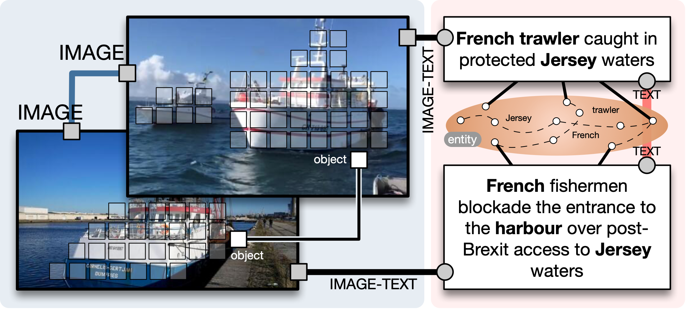

# UKnow: A Unified Knowledge Protocol

* **Title**: **[UKnow: A Unified Knowledge Protocol for Common-Sense Reasoning and Vision-Language Pre-training](https://arxiv.org/abs/2302.06891)**
* **Authors**: Biao Gong, Xiaoying Xie, Yutong Feng, Yiliang Lv, Yujun Shen, Deli Zhao
* **Institutes**: Alibaba Group, Ant Group
* **More details**: [arXiv](https://arxiv.org/abs/2302.06891) / [Home Page](null) / [魔搭社区(ModelScope)](https://www.modelscope.cn/home)

<!-- This repository will be the official Pytorch implementation for UKnow.  -->
The code, dataset, arXiv and websit will be available upon acceptance.

We are in the process of cleaning up the source code and awaiting corporate review to open source it. We will release a version of the basic UKnow in [ModelScope](https://www.modelscope.cn/home). ModelScope is built upon the notion of “Model-as-a-Service” (MaaS). It seeks to bring together most advanced machine learning models from the AI community, and streamlines the process of leveraging AI models in real-world applications.

## Overview
<!-- 
<left>
    
    <br>
    <div style="color:orange; 
    /* border-bottom: 1px solid #d9d9d9; */
    display: inline-block;
    font-size:8pt;
    line-height: 1em;
    color: #999;
    padding: 2px;">Figure 1: <b>Overview of UKnow protocol</b>, consisting of five unit knowledge types, namely, in-image <b>I_{in}</b> (e.g., object), in-text <b>T_{in}</b> (e.g., entity), cross-image <b>I_{cross}</b> (e.g., image similarity), cross-text <b>T_{cross}</b> (e.g., text continuity), and image-text <b>IT_{cross}</b> (e.g., description).</div>
</left> -->


<div style="line-height: 1em;font-size:10px">Figure 1: <b>Overview of UKnow protocol</b>, consisting of five unit knowledge types, namely, in-image <b>I_{in}</b> (e.g., object), in-text <b>T_{in}</b> (e.g., entity), cross-image <b>I_{cross}</b> (e.g., image similarity), cross-text <b>T_{cross}</b> (e.g., text continuity), and image-text <b>IT_{cross}</b> (e.g., description).</div>

<br/>

This work presents a unified knowledge protocol, called UKnow, which facilitates knowledge-based studies from the perspective of data. Particularly focusing on visual and linguistic modalities, we categorize data knowledge into five unit types, namely, in-image, in-text, cross-image, cross-text, and image-text, and set up an efficient pipeline to help construct the multimodal knowledge graph from any data collection. Thanks to the logical information naturally contained in knowledge graph, organizing datasets under UKnow format opens up more possibilities of data usage compared to the commonly used image-text pairs. Following UKnow protocol, we collect, from public international news, a large-scale multimodal knowledge graph dataset that consists of 1,388,568 nodes (with 571,791 vision-related ones) and 3,673,817 triplets. The dataset is also annotated with rich event tags, including 11 coarse labels and 9,185 fine labels. Experiments on four benchmarks demonstrate the potential of UKnow in supporting common-sense reasoning and boosting vision-language pre-training with a single dataset, benefiting from its unified form of knowledge organization. Code, dataset, and models will be made publicly available.


## Citation

If you find this work useful in your research, please cite our paper:

```
@article{Gong2023UKnow,
    title={UKnow: A Unified Knowledge Protocol for Common-Sense Reasoning and Vision-Language Pre-training},
    author={Biao Gong and Xiaoying Xie and Yutong Feng and Yiliang Lv and Yujun Shen and Deli Zhao},
    journal={arXiv:2302.06891},
    year={2023}
}
```
